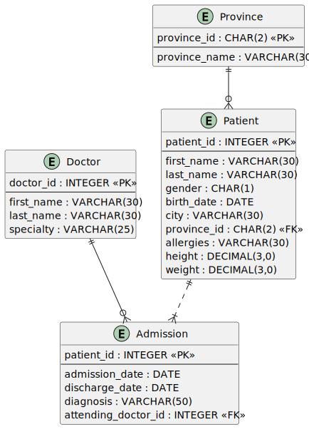

## 

https://www.sql-practice.com is an educational website which provides a test environment for SQL learners to practice their knowledge.

It provides 2 databases (hospital.db and northwind.db), and questions categorized in 3 levels of difficulty (easy, medium, hard).

## Entity Relationship Diagram (ERD): [hospital.db](www.sql-practise.com)

The "hospital.db" database was used, using OracleSQL as main DBMS.
Therefore, some implementations may slightly vary in syntax from the website's solutions.



## Answers
---

### Section 1: Easy

---

Questions 1- 17

1. Show first name, last name, and gender of patients who's gender is 'M'

```sql
SELECT first_name, last_name, gender FROM patients
WHERE gender LIKE 'M'
```

2. Show first name and last name of patients who does not have allergies. (null)

 ```sql
SELECT first_name, last_name FROM patients
WHERE allergies IS NULL
```

3. Show first name of patients that start with the letter 'C'

```sql
SELECT first_name FROM patients
WHERE first_name like 'C%'
```

4. Show first name and last name of patients that weight within the range of 100 to 120 (inclusive)

```sql
SELECT first_name, last_name FROM patients
WHERE weight <= 120 and weight >= 100
```

5. Update the patients table for the allergies column. If the patient's allergies is null then replace it with 'NKA'

```sql
update patients
set allergies = 'NKA'
where allergies IS null
```

6. Show first name and last name concatenated into one column to show their full name.

```sql
SELECT concat(first_name, " ", last_name) As full_name from patients
```

7. Show first name, last name, and the full province name of each patient.

```sql
SELECT p.first_name, p.last_name, n.province_name from patients p
inner join province_names n on p.province_id = n.province_id
```

8. Show how many patients have a birth_date with 2010 as the birth year.

```sql
SELECT count(patient_id) from patients
WHERE Year(birth_date) = 2010
```

9. Show the first_name, last_name, and height of the patient with the greatest height.

```sql
SELECT	first_name, last_name, max(height) from patients
```

10. Show all columns for patients who have one of the following patient_ids:
    1,45,534,879,1000

```sql
SELECT	* from patients
where patient_id = 1 or patient_id=45 OR patient_id = 534 OR patient_id=879 OR patient_id=1000
```

11. Show the total number of admissions

```sql
SELECT COUNT(*) total_admissions from admissions
```

12. Show all the columns from admissions where the patient was admitted and discharged on the same day.

```sql
SELECT * from admissions
where admission_date = discharge_date
```

13. Show the total number of admissions for patient_id 579.

```sql
SELECT patient_id, count(*) from admissions
where patient_id=579;
```

14. Based on the cities that our patients live in, show unique cities that are in province_id 'NS'?

```sql
SELECT DISTINCT(city) AS unique_cities
FROM patients
WHERE province_id = 'NS';
```

15. Write a query to find the first_name, last name and birth date of patients who have height more than 160 and weight more than 70

```sql
SELECT first_name, last_name, birth_date from patients
where height > 160 and weight > 70
```

16. Write a query to find list of patients first_name, last_name, and allergies from Hamilton where allergies are not null

```sql
SELECT first_name, last_name, allergies from patients
where city = 'Hamilton' and
    allergies is not null
```

17. Based on cities where our patient lives in, write a query to display the list of unique city starting with a vowel (a, e, i, o, u). Show the
    result order in ascending by city.

```sql
select distinct city
from patients
where
  REGEXP_LIKE(lower(city), '[aeiouAEIOU]%')
order by city
```

---

### Section2: Medium

---

Questions 1- 23

1. Show unique birth years from patients and order them by ascending.

```sql
SELECT distinct year(birth_date) AS birth_Year FROM patients
order by birth_Year asc
```

2. Show unique first names from the patients table which only occurs once in the list.
   For example, if two or more people are named 'John' in the first_name column then don't include their name in the output list.
   If only 1 person is named 'Leo' then include them in the output.

```sql
select first_name from patients
where first_name IS not NULL
group by first_name
HAVING count(first_name) =1
```

    Tip: HAVING clause was added to SQL because the WHERE keyword cannot be used with aggregate functions.

3. Show patient_id and first_name from patients where their first_name start and ends with 's' and is at least 6 characters long.

```sql
select patient_id, first_name from patients
where first_name like 'S%S'
group by patient_id
HAVING len(first_name) >= 6
```

    Tip: The underscore character (_) can be used in the LIKE operator to match any single character.
    For example, the following query will match any string that starts with an 's', ends with an 's', and has exactly 6 characters in between.

4. Show patient_id, first_name, last_name from patients whos diagnosis is 'Dementia'.
   Primary diagnosis is stored in the admissions table.

```sql
select p.patient_id, p.first_name, p.last_name from patients p, admissions a
where p.patient_id = a.patient_id
  AND a.diagnosis = 'Dementia'
```

5. Display every patient's first_name.
   Order the list by the length of each name and then by alphbetically.

```sql
select first_name from patients
order by len(first_name), first_name
```

6. Show the total amount of male patients and the total amount of female patients in the patients table.
   Display the two results in the same row.

```sql
SELECT
    COUNT(CASE WHEN gender = 'M' THEN 1 ELSE NULL END) AS male_count,
    COUNT(CASE WHEN gender = 'F' THEN 1 ELSE NULL END) AS female_count
FROM
    patients;
```

7. Show first and last name, allergies from patients which have allergies to either 'Penicillin' or 'Morphine'. Show results ordered ascending by allergies then by first_name then by last_name.

```sql
SELECT first_name, last_name, allergies from patients
where allergies = 'Penicillin' or allergies = 'Morphine'
order by allergies, first_name, last_name
```

8. Show patient_id, diagnosis from admissions. Find patients admitted multiple times for the same diagnosis.

```sql
SELECT patient_id, diagnosis from admissions
group by patient_id, diagnosis
having count(diagnosis) > 1
```

9. Show the city and the total number of patients in the city.
   Order from most to least patients and then by city name ascending.

```sql
SELECT city, count(patient_id) nr_patients from patients
group by city
order by 2 DESC, 1
```

10. Show first name, last name and role of every person that is either patient or doctor.
    The roles are either "Patient" or "Doctor"

```sql
SELECT first_name, last_name, 'Patient' AS role from patients
union all
SELECT first_name, last_name, 'Doctor' AS role from doctors
```

11. Show all allergies ordered by popularity. Remove NULL values from query.

```sql
SELECT 	allergies, count(allergies) total_diagnoses FROM patients
group by allergies
having count(allergies) >= 1
order by count(allergies) DESC
```

12. Show all patient's first_name, last_name, and birth_date who were born in the 1970s decade.
    Sort the list starting from the earliest birth_date.

```sql
SELECT first_name, last_name, birth_date FROM patients
where year(birth_date) between 1970 and 1979
order by birth_date

-- SQL Regex
SELECT first_name,
       last_name,
       birth_date
FROM patients
WHERE year(birth_date) LIKE '197%'
ORDER BY birth_date ASC
```

13. We want to display each patient's full name in a single column.
    Their last_name in all upper letters must appear first, then first_name in all lower case letters.
    Separate the last_name and first_name with a comma. Order the list by the first_name in decending order
    EX: SMITH,jane

```sql
SELECT concat(upper(last_name), "," , lower(first_name)) full_name from patients
order by first_name desc
```

14. Show the province_id(s), sum of height; where the total sum of its patient's height is greater than or equal to 7,000.

```sql
SELECT province_id, SUM(height) from patients
group by province_id
HAVING sum(height) >= 7000;
```

15. Show the difference between the largest weight and smallest weight for patients with the last name 'Maroni'

```sql
select max(weight)-min(weight) from (
                                        SELECT last_name, weight from patients
                                        where last_name like 'Maroni'
                                    )
```

16. Show all of the days of the month (1-31) and how many admission_dates occurred on that day.
    Sort by the day with most admissions to least admissions.

```sql
SELECT
    DAY(admission_date) AS day_number,
    COUNT(*) AS number_of_admissions
FROM admissions
GROUP BY day_number
ORDER BY number_of_admissions DESC
```

17. Show all columns for patient_id 542's most recent admission_date.

```sql
SELECT * from admissions
where patient_id = 542
group by patient_id
having max(admission_date)
```

18. Show patient_id, attending_doctor_id, and diagnosis for admissions that match one of the two criteria:
    - patient_id is an odd number and attending_doctor_id is either 1, 5, or 19.
    - attending_doctor_id contains a 2 and the length of patient_id is 3 characters.

```sql
-- OracleSQL (we would need to explicity cast the type attending_doctor_id is integer whereas LIKE method performs operations on Strings
SELECT patient_id, attending_doctor_id, diagnosis
FROM admissions
WHERE patient_id % 2 = 1 AND attending_doctor_id IN (1, 5, 19)
   OR CONCAT(attending_doctor_id) LIKE '%2%' AND LENGTH(CONCAT(patient_id)) = 3;

-- SQL
SELECT patient_id, attending_doctor_id, diagnosis
FROM admissions
WHERE patient_id % 2 = 1 AND attending_doctor_id IN (1, 5, 19)
   OR (attending_doctor_id LIKE '%2%' AND LENGTH(patient_id) = 3);
```

19. Show first_name, last_name, and the total number of admissions attended for each doctor.
    Every admission has been attended by a doctor.

```sql
SELECT d.first_name, d.last_name, COUNT(a.attending_doctor_id) admissions_total from doctors d, admissions a
where a.attending_doctor_id = d.doctor_id
group by d.doctor_id;
```

20. For each doctor, display their id, full name, and the first and last admission date they attended.

```sql
SELECT
    d.doctor_id,
    concat(d.first_name, " " ,d.last_name) full_name,
    min(a.admission_date) first_admission,
    max(a.admission_date) last_admission
from doctors d, admissions a
where a.attending_doctor_id = d.doctor_id
group by d.doctor_id;
```

21. Display the total amount of patients for each province. Order by descending.

```sql
SELECT pro.province_name, COUNT(p.patient_id) AS patient_count
FROM province_names pro
         JOIN patients p ON pro.province_id = p.province_id
GROUP BY pro.province_name
ORDER BY patient_count DESC;

--alternative
SELECT
    l.province_name, count(p.patient_id) patient_count from province_names l, patients p
where p.province_id = l.province_id
group by province_name
order by 2 desc
```

22. For every admission, display the patient's full name, their admission diagnosis, and their doctor's full name who diagnosed their problem.

```sql
SELECT
    concat(p.first_name, " ", p.last_name) patient_name,
    a.diagnosis,
    concat(d.first_name, " ", d.last_name) doctor_name
from patients p, doctors d, admissions a
where a.patient_id = p.patient_id AND a.attending_doctor_id = d.doctor_id
```

23. Display the number of duplicate patients based on their first_name and last_name.

```sql
SELECT
    first_name, last_name, count(*) num_of_duplicates
from patients
group by first_name, last_name
having count(*) > 1
```

---

### Section3: Hard

---

Questions 1- 11

1. Show all of the patients grouped into weight groups.
   Show the total amount of patients in each weight group.
   Order the list by the weight group decending. e.g. if they weight 100 to 109 they are placed in the 100 weight group, 110-119 = 110 weight group,
   etc.

```sql
SELECT
    count(patient_id),
    weight/10*10
from patients
group by 2
order by 2 DESC
```

2. Show patient_id, weight, height, isObese from the patients table. Display isObese as a boolean 0 or 1. Obese is defined as weight(kg)/(height(m)
   . Weight is in units kg. Height is in units cm.

```sql
SELECT
    patient_id,
    weight,
    height,
    (case
         WHEN weight/POWER((height*0.01),2) >=30 THEN 1
         ELSE 0
        END) isObese
from patients
-- we need to divide by 100.00 as if we divide int by int, the decimals will be truncated, ex: 100/3 = 33 BUT 100/3.0 = 33.333333333
```

3. Show patient_id, first_name, last_name, and attending doctor's specialty.
   Show only the patients who has a diagnosis as 'Epilepsy' and the doctor's first name is 'Lisa'
   Check patients, admissions, and doctors tables for required information.

```sql
SELECT
    p.patient_id,
    p.first_name,
    p.last_name,
    d.specialty attending_doctor_speciality
from patients p, doctors d, admissions a
where p.patient_id = a.patient_id and d.doctor_id = a.attending_doctor_id and d.first_name LIKE 'Lisa' AND a.diagnosis='Epilepsy'
```

4. All patients who have gone through admissions, can see their medical documents on our site. Those patients are given a temporary password after
   their first admission. Show the patient_id and temp_password.

   The password must be the following, in order:
    - patient_id
    - the numerical length of patient's last_name
    - year of patient's birth_date

```sql
select patient_id, concat(patient_id, LEN(last_name), YEAR(birth_date)) AS Password from
    (
        SELECT
            p.patient_id,
            p.last_name,
            p.birth_date
        from patients p, admissions a
        where p.patient_id = a.patient_id
        group by p.patient_id
    )
```

5. Each admission costs $50 for patients without insurance, and $10 for patients with insurance. All patients with an even patient_id have insurance.
   Give each patient a 'Yes' if they have insurance, and a 'No' if they don't have insurance. Add up the admission_total cost for each has_insurance
   group.

```sql
select
    has_insurance,
    (case
         WHEN has_insurance='Yes' THEN count(*)*10
         else count(*)*50
        end) cost_after_insurance
from
    (
        SELECT
            patient_id,
            (case
                 WHEN patient_id%2=0 THEN 'Yes'
                 else 'No'
                end) has_insurance
        from admissions
    )
group by has_insurance
```

6. Show the provinces that has more patients identified as 'M' than 'F'. Must only show full province_name

```sql
SELECT l.province_name
FROM patients p
         JOIN province_names l ON p.province_id = l.province_id
GROUP BY l.province_name
HAVING
        COUNT( CASE WHEN gender = 'M' THEN 1 END) > COUNT( CASE WHEN gender = 'F' THEN 1 END);
/*
COUNT is used to count the number of rows that meet a certain criteria, 
while SUM is used to add up the values in a particular column for rows that meet a certain criteria.
*/
```

7. We are looking for a specific patient. Pull all columns for the patient who matches the following criteria:

- First_name contains an 'r' after the first two letters.
- Identifies their gender as 'F'
- Born in February, May, or December
- Their weight would be between 60kg and 80kg
- Their patient_id is an odd number
- They are from the city 'Kingston'

```sql
SELECT *
FROM patients
where
    first_name LIKE '__r%'
  AND
    gender='F'
  AND
    month(birth_date) In (2,5,12)
  and
    weight between 60 and 80
  and
    patient_id%2!=0
  and
    city like 'Kingston';
```

8. Show the percent of patients that have 'M' as their gender. Round the answer to the nearest hundreth number and in percent form.

```sql
SELECT CONCAT(ROUND(SUM(CASE WHEN gender = 'M' THEN 1 ELSE 0 END) * 100.0 / COUNT(*), 2), '%')
FROM patients;
```

9. For each day display the total amount of admissions on that day. Display the amount changed from the previous date.

```sql
select
    admission_date,
    count(*) admission_day,
    count(admission_date) - LAG(count(admission_date)) OVER(ORDER BY admission_date) admission_count_change
from admissions
group by admission_date

--Oracle LAG() is an analytic function that allows you to access the row at a given 
-- offset prior to the current row without using a self-join
-- LAG(expression [, offset ] [, default ])
-- OVER (
--	[ query_partition_clause ] 
--	order_by_clause
-- )
```

10. Sort the province names in ascending order in such a way that the province 'Ontario' is always on top.

```sql
WITH temp_table AS (SELECT province_name FROM province_names ORDER BY (province_name = 'Ontario') DESC, province_name ASC)
SELECT province_name
FROM temp_table;
```

11. We need a breakdown for the total amount of admissions each doctor has started each year. Show the doctor_id, doctor_full_name, specialty, year, total_admissions for that year.

```sql
SELECT
    d.doctor_id,
    concat(d.first_name, " ", d.last_name) doctor_full_name,
    d.specialty,
    year(a.admission_date) year,
    count(*) total_admissions
from doctors d, admissions a
where d.doctor_id = a.attending_doctor_id
group by d.doctor_id, year(a.admission_date)
order by year(a.admission_date) desc
```
